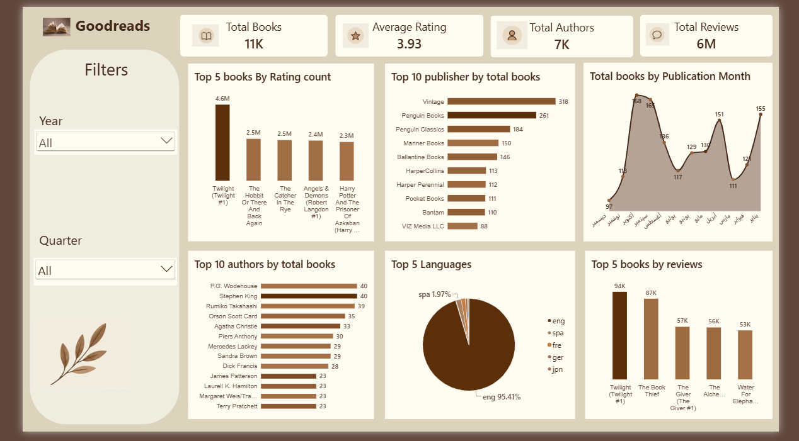

# Goodreads Books Analysis

## Project Overview

An interactive dashboard analyzing books, authors, ratings, reviews, publishers, and languages using the Goodreads dataset.

## Tools Used

- Power BI
- Power Query
- DAX
- Data Modeling
- Data Visualization

## Dashboard

### Overview

### Home Page

## Key Metrics

- Total Books: 11K
- Average Rating: 3.93
- Total Authors: 7K
- Total Reviews: 6M

## Analysis

The dashboard explores:

- Top books by rating count
- Top publishers by number of books
- Books published by month
- Top authors by number of books
- Languages distribution
- Most reviewed books

## Key Insights

The dashboard provides an interactive overview of the Goodreads dataset and allows users to explore the data using filters such as year and quarter.
